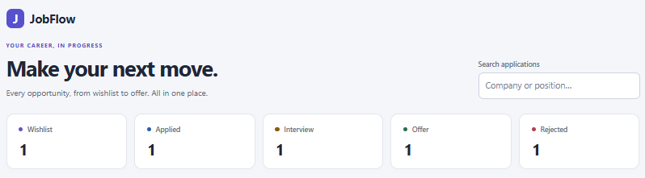
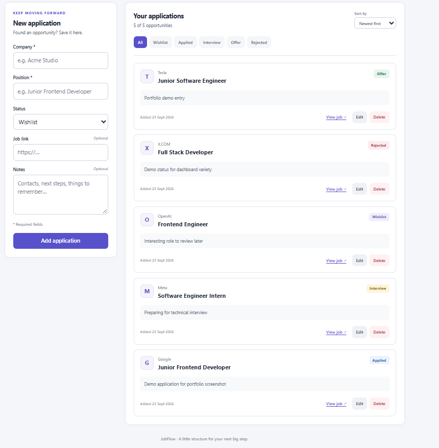

# JobFlow

A full-stack job application tracker built with React, Express.js and MySQL.

**[Live Demo](https://jobflow-frontend-production.up.railway.app)** · [Backend API](https://jobflow-production-956a.up.railway.app/api/health)

**Built with:** React · Vite · Node.js · Express.js · MySQL · Railway

The demo uses a shared application list without authentication.

## Screenshots

### Dashboard



### Application overview



## Features

- Create, edit and delete job applications
- Track application status
- Search by company or position
- Filter by status
- Sort by newest, oldest or company
- Dashboard counters
- Persistent MySQL storage
- Responsive UI
- Success and error feedback

## Tech Stack

| Layer | Technologies |
| --- | --- |
| Frontend | React, Vite, JavaScript, CSS |
| Backend | Node.js, Express.js, REST API |
| Database | MySQL |
| Deployment | Railway |

## Architecture

```text
React frontend
       ↓
Express REST API
       ↓
     MySQL
```

The frontend handles UI state, search, filters and sorting. The API validates
requests and stores application data in MySQL.

## API

| Method | Endpoint | Description |
| --- | --- | --- |
| GET | `/api/health` | Check API health |
| GET | `/api/applications` | List applications |
| POST | `/api/applications` | Create an application |
| PUT | `/api/applications/:id` | Update an application |
| DELETE | `/api/applications/:id` | Delete an application |

POST and PUT accept JSON with `company`, `position`, `status`, `link` and `notes`.
Company and position are required. Supported statuses: Wishlist, Applied,
Interview, Offer and Rejected.

## Run locally

Prerequisites: Node.js 24, npm and a running MySQL server.

1. Copy `server/.env.example` to `server/.env` and configure your local MySQL
   connection. Use `DB_NAME=jobflow` and `PORT=3001`. Keep credentials in `.env`
   and do not commit it.
2. Execute `server/schema.sql` in MySQL Workbench to create the database and table.
3. Start the backend from the project root:

   ```sh
   cd server
   npm install
   npm run dev
   ```

4. Open a second terminal at the project root and start the frontend:

   ```sh
   cd client
   npm install
   npm run dev
   ```

Open [localhost:5173](http://localhost:5173). The API runs at
[localhost:3001](http://localhost:3001/api/health).

To use a different backend, set `VITE_API_URL` in `client/.env` and restart Vite.
Run `npm run build` from `client` to create the production build in `client/dist`.
